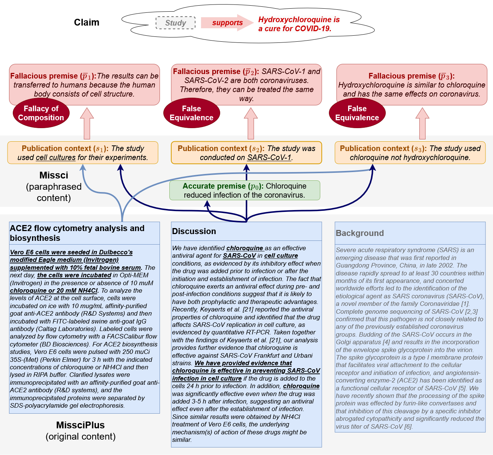

# Grounding Fallacies Misrepresenting Scientific Publications in Evidence (Preprint 2024)
[](https://opensource.org/licenses/Apache-2.0)
[](https://www.python.org/)


> **Abstract:** 
>     Health-related misinformation claims often falsely cite a credible biomedical publication as evidence, which superficially appears to support the false claim. The publication does not really support the claim, but a reader could believe it thanks to the use of logical fallacies. Here, we aim to detect and to highlight such fallacies, which requires carefully assessing the exact content of the misrepresented publications. To achieve this, we introduce MissciPlus, an extension of the fallacy detection dataset Missci. MissciPlus builds on Missci by grounding the applied fallacies in real-world passages from misrepresented studies. This creates a realistic test-bed for detecting and verbalizing these fallacies under real-world input conditions, and enables novel passage-retrieval tasks. MissciPlus is the first logical fallacy dataset which pairs the real-world misrepresented evidence with incorrect claims, identical to the input to evidence-based fact-checking models. With MissciPlus, we i) benchmark retrieval models in identifying passages that support claims only when fallacies are applied, ii) evaluate how well LLMs articulate fallacious reasoning from misrepresented scientific passages, and iii) assess the effectiveness of fact-checking models in refuting claims that misrepresent biomedical research. Our findings show that current fact-checking models struggle to use relevant passages from misrepresented publications to refute misinformation. Moreover, these passages can mislead LLMs into accepting false claims as true.


Contact person: [Max Glockner](mailto:max.glockner@tu-darmstadt.de) 

[UKP Lab](https://www.ukp.tu-darmstadt.de/) | [TU Darmstadt](https://www.tu-darmstadt.de/)

This repository contains MissciPlus, an extension of the Missci dataset ([Glockner et al., 2024](https://arxiv.org/abs/2406.03181)), which grounds fallacies in real-world passages from misrepresented scientific publications. Don't hesitate to send us an e-mail or report an issue, if you have further questions. **Code is coming soon!**

# The MissciPlus Dataset
We provide a validation split and a test split for the MissciPlus dataset, following the dataset splits in Missci:
- **Validation Split**: [missciplus-dataset/dev.missciplus.jsonl](missciplus-dataset/dev.missciplus.jsonl)
- **Test Split**: [missciplus-dataset/test.missciplus.jsonl](missciplus-dataset/test.missciplus.jsonl)
  
Each line in these files represents one instance of the dataset, which consists of a complete fallacious argument. The overall JSON structure for each instance is as follows:


```json
{
    "id": "<A unique ID for this instance (string)>",
    "meta": "<Additional information about the fact-checking article used to generate this instance (object)>",
    "argument": "<The reconstructed fallacious argument based on Missci (object)>",
    "study": "<The misrepresented scientific publication (object)>"
}
```

## How to understand the `"study"` field
Each `"study"` has the following format:
```json
{
    "pmc_id": "<PubMed Central ID of the publication>",
    "all_passages": {
        "<passage-id-1>": "<Passage content (object)>",
        "<passage-id-2>": "<Passage content (object)>",
        "...": "..."
    },
    "selected_passages": {
        "<passage-id-1>": "<Passage content (object)>",
        "<passage-id-2>": "<Passage content (object)>",
        "...": "..."
    }
}
```

All passages in `"selected_passages"` have been chosen for annotation. These passages have been compared and annotated with each paraphrased content (accurate premise and fallacy context) in the `"argument"`. We link these passages with the accurate premise and publication context, within the `"argument"` structure (see below).
The passages in `"all_passages"` comprise all parsed passages, including those that have been selected for annotation. Each passage has the following properties:
| Property | Description | 
|----------|----------|
| `"passage_id"`    | The unique passage ID  | 
| `"section"`    | The title of the passage's section (if available). | 
| `"sentences"`    | A list of the passage sentences.   | 
| `"from"`    | Indicates whether the passage was collected from the structured abstract (`"abstract"`) or the main paper content (`"main"`).   | 

**Example:**
```json
{
    "section": "Postinfection chloroquine treatment is effective in preventing the spread of SARS-CoV infection",
    "sentences": [
        "In order to investigate the antiviral properties of chloroquine on SARS-CoV after the initiation of infection, Vero E6 cells were infected with the virus and fresh medium supplemented with various concentrations of chloroquine was added immediately after virus adsorption.",
        "Infected cells were incubated for an additional 16-18 h, after which the presence of virus antigens was analyzed by indirect immunofluorescence analysis.",
        "When chloroquine was added after the initiation of infection, there was a dramatic dose-dependant decrease in the number of virus antigen-positive cells (Fig. 2A).",
        "As little as 0.1-1 muM chloroquine reduced the infection by 50% and up to 90-94% inhibition was observed with 33-100 muM concentrations (Fig. 2B).",
        "At concentrations of chloroquine in excess of 1 muM, only a small number of individual cells were initially infected, and the spread of the infection to adjacent cells was all but eliminated.",
        "A half-maximal inhibitory effect was estimated to occur at 4.4 ± 1.0 muM chloroquine (Fig. 2C).",
        "These data clearly show that addition of chloroquine can effectively reduce the establishment of infection and spread of SARS-CoV if the drug is added immediately following virus adsorption."
    ],
    "from": "main",
    "passage_id": "PMC1232869-7"
}
```


## Grounding the `"argument"` in the `"study"`
In the Missci dataset, each `"argument"` is structured as follows:
```json
{
    "claim": "<The claim that misrepresents the scientific publication (string.)>",
    "accurate_premise_p0": {
        "premise": "<The paraphrased study content based on which the claim was made (string).>"
    },
    "fallacies": [
        {
            "fallacy_context": "<The paraphrased study content based on which the fallacy can be detected (string).>",
            "interchangeable_fallacies": "<List of the verbalized fallacious premises and the applied fallacy classes (list[object]).>"
        },
        {
            "<more fallacies>": "..."
        }
    ]
}
```

The content of the `"premise"` field (in `"accurate_premise_p0"`) and the `"fallacy_context"` field (for each fallacy in `"fallacies"`) paraphrases content from the misrepresented study. These fields should, if possible, be linked to a passage within `"study"`.
To provide this linkage, we include a `"mapping"` property. This property contains a list of mappings to all `"selected_passages"` that convey the same information as the the paraphrased field content. If the `"mapping"` list is empty, it means no passage could be linked to the accurate premise or fallacy context. Each entry in a successful mapping has the following properties:


| Property | Description | 
|----------|----------|
| `"passage"`    | The unique passage ID that communicates the same information as this field. | 
| `"sentence_annotations"`    | Indicates which sentences have been selected to convey the same information as the paraphrased content (via the selected sentence indices per annotator). | 
| `"sentences"`    | A list of all sentence indices selected by any annotator. | 

**Example:**
```json
{
    "accurate_premise": {
        "premise": "Chloroquine reduced infection of the coronavirus.",
        "mapping": [
            {
                "passage": "PMC1232869-19",
                "sentence_annotations": [[0, 1, 4, 5], [0, 1, 2, 3, 4]],
                "sentences": [0, 1, 2, 3, 4, 5]
            },
            {"...": "..."}
        ]
    }
}
```

# Code to reproduce the results
Below are instructions to reproduce the results reported in our publication.

## Install
````shell
conda env create --file missciplus.yml
conda activate missciplus
````

## Training the AFC Models

**1. Download Datasets:**
   - Navigate to the `afc_data` directory:
     ```bash
     cd ./afc_data
     ```
   - Run the script to download the datasets:
     ```bash
     bash download-afc-datasets.sh
     ```

**2. Train Fact-Checking Transformers:**
   Use the following command to train the models. Note that square brackets `[]` indicate placeholders for user-defined values:

   ```bash
   python run-afc.py train [dataset] [model] [name] [seed] [lr] [batch-size]
   ```

| Parameter | Description | Example |
|---|---|---|
| `dataset` | Name of the training dataset. Choose from `scifact`, `covidfact`, `healthver`, or combine them with `sci-health-cov` | `scifact` |
| `model` | Name of the pre-trained transformer model | `microsoft/deberta-v3-large` |
| `name` | Name you assign to the trained model | `deberta-scifact` |
| `seed` | Random seed for training reproducibility | `1` |
| `lr` | Learning rate for model optimization | `0.00005` |
| `batch-size` | Number of samples processed at once during training | `8` |

**Example:**
````shell
python run-afc.py train scifact microsoft/deberta-v3-large deberta3-lg-seed1 1 0.00005 8
````

## Subtask 1 (Find the accurate premise passage)

This tasks the LLM to rank passages such that a passage communicating the accurate premise is ranked first.

### Non-LLM based methods

Run the following command to execute non-LLM based ranking methods:

```bash
python run-subtask1.py [method] [--fullstudy] [--dev]
```

| Parameter       | Description                                                                                                                                              | Example                 |
|-----------------|----------------------------------------------------------------------------------------------------------------------------------------------------------|-------------------------|
| `method`          | The ranking method to be executed. Choose one of `bm25`, `random`, `ordered`, `sentence-embeddings`, or `afc-eval`.  | `bm25`                  |
| `--fullstudy` (Optional) | By default, the model only runs on the annotated passages (*closed setup*). Add `--fullstudy` to consider all passages of the publication (*open setup*). | `--fullstudy` (flag)    |
| `--dev`          (Optional) | By default, the model runs on the *test* instances. Add `--dev` to run the model on the *dev* instances.                                                 | `--dev` (flag)          |

#### Run sentence-embedding ranking
To execute any of the sentence-embedding-based ranking models, use the following command:
````shell
python run-subtask1.py sentence-embeddings [model] [variant] [--k=k] [--add-title] [--fullstudy] [--dev]
````

| Parameter | Description | Example |
|---|---|---|
| `model` | Sentence embedding model | `sbert` |
| `variant` | Sentence aggregation strategy (concat or mean) | `mean` |
| `--k <k>` | Number of sentences to consider (top `k` highest-scoring, only for `mean`) | `--k 3` |
| `--add-title` | Add section title to sentences | `--add-title` |


To use a fact-checking model for ranking, ensure it has been trained as described above and then run the following command:
````shell
python run-subtask1.py sentence-embeddings [model] [variant] [--k=k] [--add-title] [--fullstudy] [--dev]
````

**Possible sentence embedding models are:**

| Model Name              | Description                                                                                                       | Source                                                                             |
|--------------------------|-------------------------------------------------------------------------------------------------------------------|------------------------------------------------------------------------------------|
| `sbert`                  | Pre-trained sentence transformer model (`"all-mpnet-base-v2"`).                                                | [Reimers et al. (2019)](https://aclanthology.org/D19-1410/)                        |
| `biobert-st`             | Fine-tuned sentence transformer using BioBERT (`"pritamdeka/BioBERT-mnli-snli-scinli-scitail-mednli-stsb"`).       | [Deka et al. (2022)](https://link.springer.com/chapter/10.1007/978-3-031-20627-6_1) |
| `sapbert-st`             | Fine-tuned sentence transformer using SapBERT (`"pritamdeka/SapBERT-mnli-snli-scinli-scitail-mednli-stsb"`).       | [Deka et al. (2022)](https://link.springer.com/chapter/10.1007/978-3-031-20627-6_1) |
| `pubmedbert-st`          | Fine-tuned sentence transformer using PubMedBERT (`"pritamdeka/PubMedBERT-mnli-snli-scinli-scitail-mednli-stsb"`). | [Deka et al. (2022)](https://link.springer.com/chapter/10.1007/978-3-031-20627-6_1) |
| `instructor`           | INSTRUCTOR embeddings trained to find passages **supporting** the claim.                                            | [Su et al. (2023)](https://aclanthology.org/2023.findings-acl.71/)                 |
| `instructor-refute`      | INSTRUCTOR embeddings trained to find passages **undermining** the claim.                                           | [Su et al. (2023)](https://aclanthology.org/2023.findings-acl.71/)                 |
| `instructor-undermine`   | INSTRUCTOR embeddings trained to find passages **refuting** the claim.                                                  | [Su et al. (2023)](https://aclanthology.org/2023.findings-acl.71/)                 |
| `ims`                    | The trained IMS model.                                                                                            | [Wright et al. (2022)](https://aclanthology.org/2022.emnlp-main.117/)              |


## AFC-based Ranking

Ensure you have trained AFC models as described previously. This code assumes five trained models and averages their results.

**Step 1:**  Run inference on the dataset:
````shell
python run-afc inference missci <training data>/<model name>
````
Replace ``<training data>`` with the chosen training dataset (e.g., ``healthver``) and ``<name>`` with the designated model name from the training. This will generate prediction files in the ``predictions/afc-missci/<training data>/<model name>`` directory.

**Step 2:** Execute the ranking using the predicted probabilities from the generated files. Run the following command:
````shell
python run-subtask1.py afc-eval [training data] <split>__missci.jsonl 
````

**Example:**
````shell
python run-subtask1.py afc-eval healthver dev__missci.jsonl --dev
````

### LLM-based ranking


First, edit the `llm-config.json` file. For each LLM (e.g., `"llama3"`, `"llama2"`), add a new entry with a `"directory"` field.
```json
{
  "llama3": {
    "directory": "/path/to/llama3/model/directory"
  }
}
```
The `"directory"` should include the different LLM versions (e.g., `70B-Instruct`).

#### Run the code

To run the pairwise LLM-based ranking via PRP [(Qin et al., 2024)](https://aclanthology.org/2024.findings-naacl.97/), run:
````shell
python run-subtask1-llm-pairwise.py [llm] [template] [size] [iterations] [initial_order] [--temperature <temperature>] [--dev] [--add-section]
````

The provided code supports the following parameters (assuming the `llm-config.json` is accurate):

| Parameter       | Description                                                                                           | Example             |
|-----------------|-------------------------------------------------------------------------------------------------------|---------------------|
| `llm`           | Used LLM (`llama2`, `llama3`, `chatgpt`).                                                             | `llama3`            |
| `template`      | The prompt template used for pairwise ranking. Select one within the `prompt_templates/prp` directory. | `prp/qin2023-txt`   |
| `size`          | LLM size (only for Llama models). Select one of (`8b`, `70b`) for Llama3 or (`7b`, `70b`) for Llama2. | `8b`                |
| `iterations`    | Number of iterations using the PRP algorithm.                                                         | `3`                 |
| `initial_order` | The initial ordering of the passages. Select one of (`natural-order`, `random`).                      | `natural-order`     |
| `--temperature` | The temperature (only for Llama models).                                                              | `--temperature 0.3` |
| `--add-section` | Add the section title to the passages (if set).                                                        | `--add-section`     |


**Example:**:
````shell
run-subtask1-llm-pairwise.py llama3 prp/qin2023.txt 8b 2 natural-order --dev 
````

## Subtask 2 (Find fallacious premise passages)
This tasks the LLM to rank passages to identify those that indicate fallacious reasining.

To run the methods, run the following command. It will always run over *all* passages of the study (*open setting*):
````bash
python run-subtask2-open.py [method] [--dev]
````

You can choose from the following methods:

| Name | Description |
| --- | --- |
| `random` | Randomly shuffle the passages. |
|`ordered` | Order passages in their original order how they occur in the publication |
| `bm25` | Use BM25-based ranking |
| `sentence-embeddings` | Sentence-embedding based ranking |
| `afc-eval` | fact-checking model based ranking |

### Running BM25
````bash
python run-subtask2-open.py bm25 [seed] [--p0] [--dev]
````
Add ``--p0`` to add a randomly selected passage that communicates the accurate premise to the input.

### Running sentence-embeddings
````bash
python run-subtask2-open.py sentence-embeddings [model] [variant] [seed] [--k <k>] [--p0] [--dev]
````
Add ``--p0`` to add a randomly selected passage that communicates the accurate premise to the input. The remaining parameters are identical to Subtask 1.

### Running fact-checking models
````bash
python run-subtask2-open.py afc-eval [training data] [strategy] [--add-p0 <variant>] [--dev]
````
Use the following parameter:

| Paramerter      | Possible Value  | Description                                                                             | 
|-----------------|-----------------|-----------------------------------------------------------------------------------------|
| `training data` | *dataset name*  | Training data from the fact-checking model (e.g., `scifact`)                            |
| `strategy`      | *see below*     | The aggregation strategy that maps the fact-checking prediction to a numerical score.   |
| `strategy`      | `s`             | The predicted probability for the label *Supported*                                     |
| `strategy`      | `r`             | The predicted probability for the label *Refuted*                                       |
| `strategy`      | `s+n`           | Sum of predicted probability for the labels *Supported* and *Not Enough Information*    |
| `strategy`      | `s+r`           | Sum of predicted probability for the labels *Supported* and *Refuted*                   |
| `--add-p0`      | *see below*     | Defines how (and if) to add a accurate premise passage.                                 |
| `--add-p0`      | `claim-passage` | Prepend the accuracte premise passage to the claim (make sure to have run this model)   |
| `--add-p0`      | `claim-evidence` | Prepend the accuracte premise passage to the evidence (make sure to have run this model) |
| `--add-p0`      | -               | Omit to add no accurate premise passage.                                                |


## Subtask 3 (Reconstruct fallacious arguments)

### Train the Llama3-8B evaluator
First, to create a Llama3-8B premise judge, run the following command:
````bash
python create-premise-judge.py full-sft llama3 8b same-reasoning-4 --epochs 5 --bs-acc=4 --scheduler linear --lr 5e-4 --lora-alpha 16 --lora-dropout 0.2 --lora-r 64
````

### Run argument reconstruction

#### For passage-wise argument reconstruction run
````shell
python run-subtask-3.py passage-wise [llm] [template] [seed] [--temperature=<temperature>] [--dev] [--add-section] [--small]
````
For example, to run Llama3 8B, run:
````shell
python run-subtask-3.py passage-wise llama3 reconstruct-passage/p7-passage-DLE.txt 1 --temperature 0.3 --dev --small
````

#### To reconstruct the argument based on concatenated passages run
````shell
python run-subtask-3.py concat-passages [llm] [template] [seed] [<file>] [--temperature=<temperature>] [--small]
````

For example:
````shell
python run-subtask-3.py concat-passages llama3 reconstruct-concat/p1-basic-DLE.txt 1 p0-ordered --temperature 0.2 --small --dev
````

#### Evaluate
The raw predictions with the LLM outputs will be stored in ``predictions/argument-reconstruction-raw/`` (e.g. `st3-concat__reconstruct-concat--p1-basic-DLE__llama3_8b_t-0.2-s1-tFalse-Op0-ordered-aFalse.dev.jsonl`)

**Step 1:** Parse the output.
````shell
python run-subtask-3.py parse st3-concat__reconstruct-concat--p1-basic-DLE__llama3_8b_t-0.2-s1-tFalse-Op0-ordered-aFalse.dev.jsonl --dev
````

**Step 2:** Map the output to the argument level.
````shell
python run-subtask-3.py map st3-concat__reconstruct-concat--p1-basic-DLE__llama3_8b_t-0.2-s1-tFalse-Op0-ordered-aFalse.dev.jsonl --dev
````

**Step 3:** Evaluate.
````shell
python run-subtask-3.py evaluate st3-concat__reconstruct-concat--p1-basic-DLE__llama3_8b_t-0.2-s1-tFalse-Op0-ordered-aFalse.dev.mapped.jsonl --dev
````

# Citation
When using MissciPlus, please ensure to cite the following publications:

```bibtex 
@inproceedings{glockner2025grounding,
  title={{Grounding Fallacies Misrepresenting Scientific Publications in Evidence}],
  author={Glockner, Max and Hou, Yufang and Nakov, Preslav and Gurevych, Iryna},
  booktitle={To appear at NAACL 2025},
  year={2025},
}

@inproceedings{glockner-etal-2024-missci,
    title = "Missci: Reconstructing Fallacies in Misrepresented Science",
    author = "Glockner, Max  and
      Hou, Yufang  and
      Nakov, Preslav  and
      Gurevych, Iryna",
    editor = "Ku, Lun-Wei  and
      Martins, Andre  and
      Srikumar, Vivek",
    booktitle = "Proceedings of the 62nd Annual Meeting of the Association for Computational Linguistics (Volume 1: Long Papers)",
    month = aug,
    year = "2024",
    address = "Bangkok, Thailand",
    publisher = "Association for Computational Linguistics",
    url = "https://aclanthology.org/2024.acl-long.240",
    pages = "4372--4405"
}
```
> This repository contains experimental software and is published for the sole purpose of giving additional background details on the respective publication

